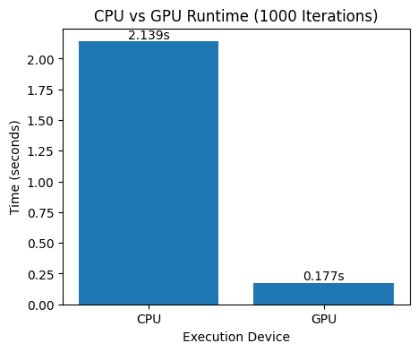
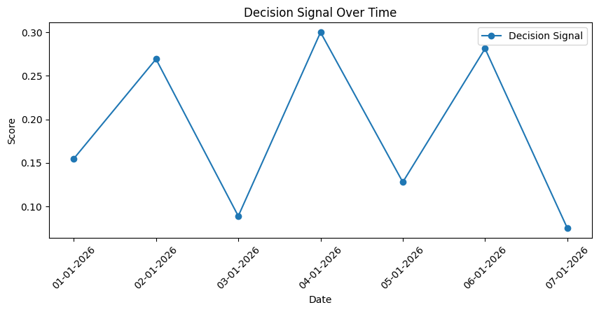
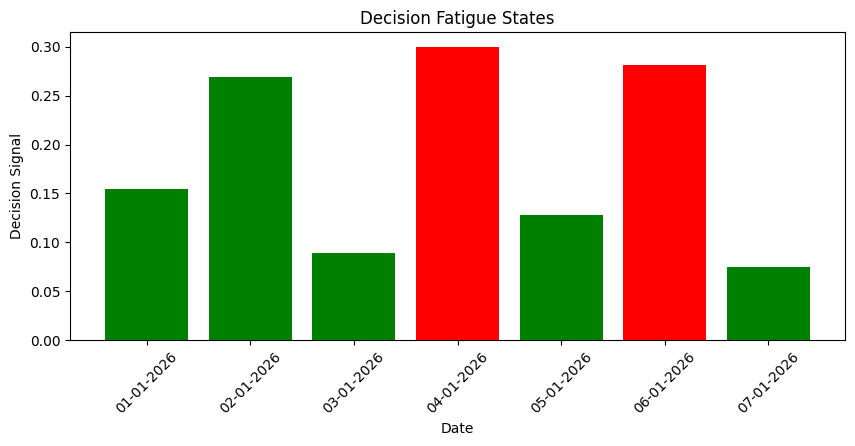

# Decision Fatigue & Cognitive Overload Detection System  
*A CUDA-accelerated behavioral inference system*

[ Run Live Demo in Colab](https://colab.research.google.com/github/Snigdha-new/decision-fatigue-cuda-system/blob/main/DECISION_FATIGUE.ipynb)

## Overview
This project detects silent cognitive overload and decision fatigue from passive mobile usage data using a hybrid rule-based and machine learning pipeline.  
It demonstrates performance engineering by accelerating feature computation with a custom CUDA kernel and benchmarking CPU vs GPU execution.

## Problem Statement
Most digital wellness systems rely on self-reported user input. This system explores whether passive smartphone usage patterns can be transformed into interpretable indicators of cognitive strain and decision difficulty.

## System Architecture
Screen Time CSV
↓
Feature Engine
├─ CPU Path
└─ GPU Path (CUDA Kernel)
↓
Inference Engine
├─ Rule-Based Logic
└─ ML Baseline
↓
Explanation Layer
↓
Web Interface (Gradio in Colab)

## Tech Stack
- Python
- Pandas / NumPy
- Scikit-learn
- Numba CUDA
- Matplotlib
- Gradio
- Google Colab (NVIDIA GPU)

## Performance Summary
Benchmarked CPU vs GPU under increasing batch workloads.  
GPU overhead dominates at small workloads, while GPU acceleration provides measurable speedup at scale.

## How to Run
1. Click **Run Live Demo in Colab**
2. Runtime → Change runtime type → GPU
3. Run all cells
4. Upload `screen_time.csv` when prompted

## Results & Visualizations
### CPU vs GPU Performance

### Decision Signal Over Time

### Decision Fatigue States

## Limitations & Ethics
- Small pilot dataset
- Behavioral inference only — not a medical or psychological diagnostic tool
- Privacy-preserving design: no raw personal data is stored or transmitted

## Author
Snigdha  
Information Science 
Focus: Systems, ML, GPU Computing, Human-Centered AI

