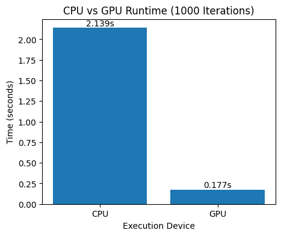
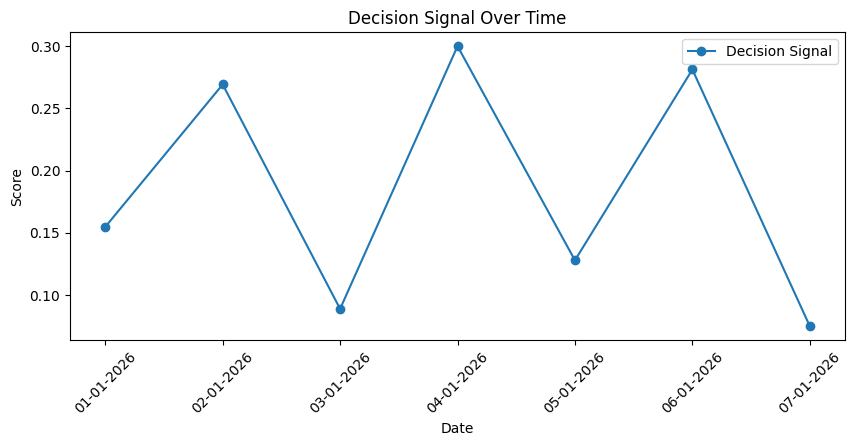
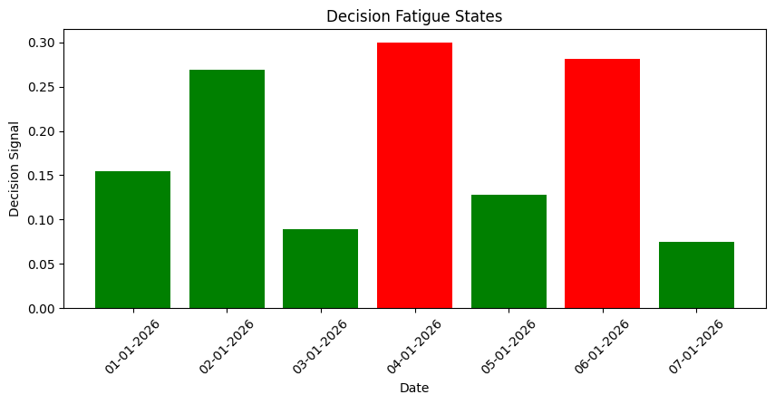

# Decision Fatigue & Cognitive Overload Detection System

*A CUDA-accelerated behavioral inference system.*

## Live Demo

[Run in Google Colab](https://colab.research.google.com/github/Snigdha-new/decision-fatigue-cuda-system/blob/main/DECISION_FATIGUE.ipynb)

## Overview

This project explores whether passive smartphone usage patterns can be used to infer cognitive overload and decision fatigue.

The system processes screen-time data, extracts behavioral features, and generates interpretable fatigue signals using a hybrid rule-based and machine learning pipeline. To improve performance, feature computation is accelerated using a custom CUDA kernel.

## Tech Stack

* Python
* Pandas & NumPy
* Scikit-learn
* Numba CUDA
* Matplotlib
* Gradio
* Google Colab

## Architecture

```text
Screen Time CSV
        ↓
Feature Extraction
   ├─ CPU Pipeline
   └─ GPU Pipeline (CUDA)
        ↓
Inference Engine
   ├─ Rule-Based Logic
   └─ ML Baseline
        ↓
Explanation Layer
        ↓
Gradio Interface
```

## Performance Results

Benchmark (1000 iterations):

| Device | Runtime |
| ------ | ------- |
| CPU    | 2.139 s |
| GPU    | 0.177 s |

**Result:** Approximately **12× faster execution** using CUDA acceleration.

## Key Findings

* Peak fatigue signal: **0.30**
* Lowest fatigue signal: **0.08**
* High-fatigue states detected on **2 of 7 analyzed days**
* Generated interpretable behavioral indicators from passive usage data

## How to Run

1. Open the Colab notebook
2. Enable GPU support
3. Run all cells
4. Upload `screen_time.csv`

## Results

### CPU vs GPU Performance



### Decision Signal Over Time



### Decision Fatigue States



## Limitations

* Small pilot dataset
* Behavioral inference only
* Not a medical or psychological diagnostic tool

## Future Improvements

* Larger datasets
* Real-time monitoring
* Personalized fatigue thresholds
* Transformer/LSTM-based modeling

## Author

**Snigdha**
Information Science Engineering

Interests: Machine Learning, Systems Engineering, GPU Computing, Human-Centered AI


